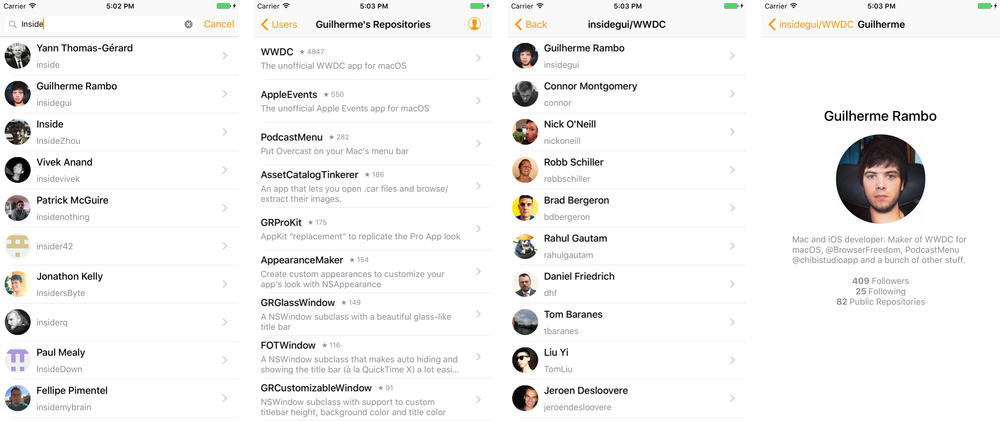

## Astronomer

An app that lets you search for Github users and look at who has starred their repositories.

This app was created as an architectural demonstration for my talk at the [CocoaHeads Conference 2016](http://cocoaheadsconference.com.br).



### Architectural overview

I didn't use a specific design pattern to build the app, there are elements from many different patterns, so I chose not to name any ;)

#### AppRouter

The router handles presentation of view controllers and navigation between them. The app's view controllers have delegate protocols the router implements to handle events that should trigger a navigation.

#### View Controller

Each view controller is responsible for configuring its views and implementing any view-specific protocols (data source, delegate, etc).

#### View Models

View models wrap the models and expose useful information that can be used by views and view controllers to present the model's information on screen. They are also responsible for implementing diffing between models.

#### Models

The models in this app are simple `structs`, they don't  "do" anything, they only store data and implement the `Equatable` protocol.

#### Adapters

An adapter is an object that takes an input and transforms (adapts) it to a specific output. In this app there are adapters to take the json returned form the Github API and turn it into models.

#### Storage Controller

The storage controller takes models and stores them in a database (I'm using [Realm](https://realm.io)).

#### API Client

The API client calls the Github API, gets the json data and turns it into model structs using adapters.

#### Data Provider

The data provider is the glue between the API Client, the Storage Controller and other objects that use the data (mainly view controllers). 

The view controllers in this app don't talk to the network, they subscribe to obervers on the Data Provider, which uses the API Client to fetch data and stores the data on the database. By storing the data, it makes the observer emit a new event containing the updated results.

Both the API Client and Storage Controller implement protocols (`APIClient` and `Storage`), the Data Provider is injected with objects implementing these protocols, so both the API and storage layers can be changed without affecting the entire app (this is also useful when testing).

#### Testing

For this demonstration, I am only testing the adapters and the storage controller.

#### Dependencies

These are the dependencies I'm using:

- [SwiftyJSON](https://github.com/SwiftyJSON/SwiftyJSON) to parse JSON
- [Siesta](http://siestaframework.com) for networking
- [Realm](http://realm.io) for data storage
- [RxSwift](https://github.com/ReactiveX/RxSwift/) for reactive extensions
- [IGListDiff](https://github.com/insidegui/IGListDiff) to do diffing between collections

## Building steps

! Building tested on Xcode 8.1, macOS 10.12.1.

### Clone the repository

```
$ git clone https://github.com/insidegui/Astronomer
```

### Build dependencies

This project uses Carthage to manage its dependencies.

```
$ cd Astronomer/Astronomer && carthage update --no-use-binaries
```

### Add Github API credentials

[You will need a read-only personal access token from Github](https://github.com/settings/tokens).

Rename the file `Credentials_Sample.swift` to `Credentials.swift` and enter your username and access token.